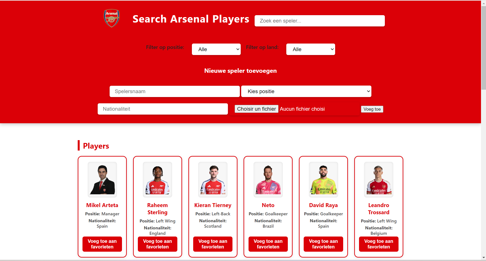
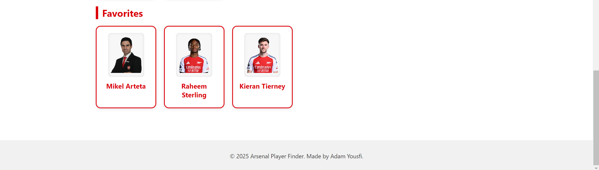
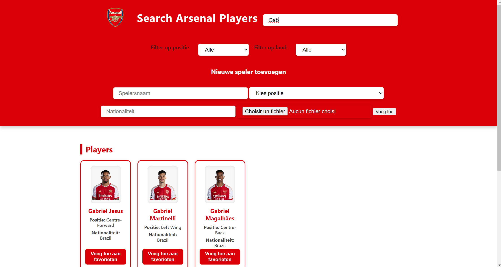
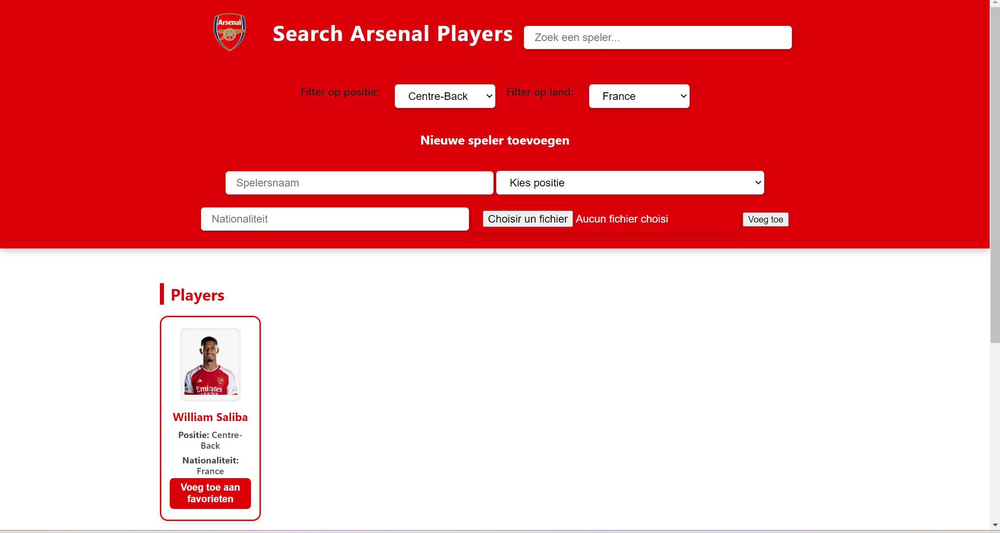

# Arsenal Players Dashboard

Een interactieve webapplicatie gebouwd met **Vite** en **moderne JavaScript** om Arsenal-spelers op te zoeken, filteren en bewaren als favorieten. Data wordt opgehaald van een externe API en opgeslagen in localStorage voor personalisatie en persistente gebruikerservaring.

---

## Projectbeschrijving

Deze webapplicatie toont een overzicht van Arsenal-spelers met de mogelijkheid om te zoeken, filteren, favorieten te beheren en nieuwe spelers toe te voegen. De applicatie haalt standaard spelersdata op via de publieke [TheSportsDB API](https://www.thesportsdb.com/api.php) en slaat gegevens lokaal op in `localStorage` zodat gebruikers hun favorieten en toegevoegde spelers behouden tussen sessies.

De app is volledig client-side gebouwd met HTML, CSS en JavaScript. Lazy loading van afbeeldingen zorgt voor een betere performance. **gebruikersinteractie**, **personalisatie**, **responsieve vormgeving**, en **volledige implementatie van moderne JavaScript-concepten**.


---

##  Gebruikte API

- [TheSportsDB API](https://www.thesportsdb.com/api/v1/json/3/searchplayers.php?t=Arsenal)  
  Wordt gebruikt om de lijst met Arsenal-spelers op te halen.  
---

##  Functionele vereisten

| Functie                         | Uitleg |
|--------------------------------|--------|
| API-data ophalen               | Via `fetch()` en `async/await` wordt data van arsenal spelers opgehaald |
| Dynamische lijst met data      | kolommen met o.a. naam, land, positie, foto,... |
| Filterfunctie                  | Live filter op naam, land of positie |
| Zoekfunctie                    | Live zoekveld met directe filtering |
| Sorteren                       | Sorteren op land |
| Favorieten opslaan            | Toggle knop om spelers op te slaan als favoriet |
| Sessies bewaren                | Favorieten blijven behouden na herladen |
| Observer API                  | De code laadt afbeeldingen pas als ze in beeld komen. |
| Responsief ontwerp             | Mobielvriendelijk via CSS Flexbox en media queries |
| SPA zonder reload              | Alles via JS DOM manipulatie zonder pagina herlaadt |

---

## Technische vereisten

Hieronder een overzicht van alle toegepaste JavaScript-concepten zoals vereist in het project:

---

## Implementatie van elke technisch vereiste 

### DOM manipulatie
- **Elementen selecteren:**  
  Bovenaan het script, direct na `DOMContentLoaded`, worden alle benodigde DOM-elementen geselecteerd met `getElementById`.
- **Elementen manipuleren:**  
  In de functies `renderPlayers`, `renderFavorites` en `updateFilters` wordt de DOM aangepast via `.innerHTML` en `.appendChild`.
- **Events aan elementen koppelen:**  
  Event listeners worden toegevoegd aan zoekveld, filters, formulier en favorietenknoppen via `.addEventListener`.

### Modern JavaScript
- **Gebruik van constanten:**  
  Voor vaste waarden zoals `STORAGE_PLAYERS_KEY`, `STORAGE_FAVORITES_KEY` en DOM-elementen.
- **Template literals:**  
  Voor HTML-opbouw in de functies `renderPlayers` en `renderFavorites` (bijvoorbeeld: ``card.innerHTML = `...`;``).
- **Iteratie over arrays:**  
  Met `.forEach()` en `.map()` in de render- en filterfuncties.
- **Array methodes:**  
  Gebruik van `.map()`, `.filter()`, `.forEach()`, `.some()`, etc.
- **Arrow functions:**  
  Overal toegepast, bijvoorbeeld in event handlers en bij array-methodes.
- **Conditional (ternary) operator:**  
  Voor het wisselen tussen "Voeg toe aan favorieten" en "Verwijder uit favorieten" in de knop.
- **Callback functions:**  
  Bij `reader.onload = (e) => ...` in de submit-handler.
- **Promises:**  
  In de fetch-aanroep met `.then()` en `.catch()`.
- **Observer API:**  
  Voor lazy loading van afbeeldingen met `IntersectionObserver` in de variabele `imageObserver`.

### Data & API
- **Fetch om data op te halen:**  
  Spelersdata wordt opgehaald met `fetch()` vanuit de API in de laatste codeblokken.
- **JSON manipuleren en weergeven:**  
  Met `.json()` op de fetch-respons en verwerking van het resultaat in de `.then()`-keten.

### Opslag & validatie
- **Formulier validatie:**  
  In de submit-handler van `addPlayerForm` wordt gecontroleerd of alle verplichte velden zijn ingevuld.
- **Gebruik van LocalStorage:**  
  Spelers en favorieten worden opgeslagen en geladen via `localStorage` in de functies `saveToLocalStorage` en `loadFromLocalStorage`.

### Styling & layout
- **Basis HTML layout (flexbox of CSS grid):**  
  Toegepast in het HTML-bestand en de CSS (zie `index.html` en `style2.css`).
- **Basis CSS:**  
  In het CSS-bestand (`style2.css`).
- **Gebruiksvriendelijke elementen:**  
  Duidelijke knoppen voor favorieten, labels en foutmeldingen in de HTML en JS.

### Tooling & structuur
- **Project is opgezet met Vite:**  
 [Vite.js](https://vitejs.dev/) – snelle ontwikkelomgeving
- **Correcte folderstructuur:**  
  HTML, CSS en JS zijn gescheiden in aparte bestanden en mappen.


##  Installatiehandleiding

1. Clone de repository:
   ```bash
   git clone <gh repo clone adyousfi/Web-Advanced-Final-Project>
   ```
2. Installeer de dependencies:
   ```bash
   npm install
   ```
3. Start de dev server:
   ```bash
   npm run dev
   ```
4. Open je browser op `http://localhost:5173`

##  Screenshots
### 🔸 Homepagina


### 🔸 Favorieten opslaan


### 🔸 Zoekbalk


### 🔸 Filter


##  Gebruikte bronnen
- 
- [Vite](https://vitejs.dev/)
- [TheSportsDB API](https://www.thesportsdb.com/api.php)
- OpenAI – voor hulp en ondersteuning tijdens de ontwikkeling.
- ChatGPT chatlog voor Vite installatie en controle README: https://chatgpt.com/share/682f718f-5f3c-8010-a11f-e18a518e63dc 


